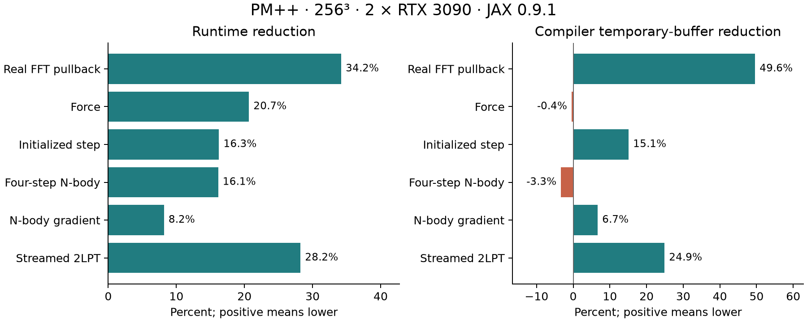

# Two-GPU performance results

On 8 September 2026, the `performance_imrpovements` branch reduced the
measured four-step N-body runtime by **16.1%** and its full-gradient runtime
by **8.2%** relative to commit `1406f9188881cecb8ff20cfb1c7bbaea28a3a830`.
All seven proposed areas are addressed; capacity defaults remain unchanged
until representative workload measurements justify reducing them.

## Follow-up AD correction

The timing results below describe optimization commit `8d4ecc5`, before the
subsequent mesh-halo drift-adjoint repair. The repair's runtime has not been
benchmarked with this four-step workload.

A separate 63-step cosmological workload exposed a pre-existing error: float32
rounding during reverse-drift reconstruction could change a particle's GPU
when the forward migration was replayed. This shifted sorted particle rows
and attached cotangents to the wrong identities, despite correct forward mass
and density. The repaired adjoint carries cotangents through the same
post-to-pre routing plan as their particles, eliminating that replay.

On two RTX 3090s, the reproduced 256-cubed failure changed from a scalar
Omega_m gradient of approximately `0.278153` to `0.346317`, agreeing with
PMWD's `0.346318`. The repaired 512-cubed gradient agrees with the saved PMWD
reference within `0.00036%`; local PMWD forward finite differences also support
that reference. The repaired density fields agree with local PMWD to relative
L2 errors below `2.6e-7`, with exact total mass.

The focused solver/routing suite passed all 35 tests. The new identity
regression fails on the original helper with two, four, and eight logical CPU
devices; the repair passes with four/eight logical devices and two physical
GPUs, including native routing. Physical eight-H200 validation of the repair
remains outstanding. Historical PM++ gradients affected by this error are not
a correctness reference for new AD measurements.

## Matched measurements

These are medians from fresh, sequential processes on two NVIDIA RTX 3090
24 GB GPUs, under WSL Ubuntu 22.04 with JAX/JAXlib 0.9.1 and CUDA 12.4.
Both revisions used native CUDA routing, `mesh_halo`, float32 state, int16
particle coordinates, a 256-cubed particle grid and mesh, and mesh factor 1.
Each GPU had capacity for 11,744,051 particles; each migration direction had
capacity 262,144. Capacities were identical between revisions.

The controlled input is a grid with displacement `0.2 + 0.1*sin(pmid)` and
velocity `0.001*disp`. N-body evolves from scale factor 0.20 to 0.24 in four
steps. This is a short, smooth benchmark, not a production-scale clustering
or capacity qualification. An initialized step includes the initial force
and one leapfrog step. The full gradient includes the forward simulation
and the custom adjoint.

Each compiled executable was warmed three times. Timings exclude compilation
and synchronize every result; each phase has at least 15 repetitions totaling
at least one second. Raw samples and their 10th/90th percentiles are saved.

| Phase | Baseline (ms) | Optimized (ms) | Runtime reduction | Compiler temporary-buffer reduction |
| --- | ---: | ---: | ---: | ---: |
| Real FFT pullback | 7.50 | 4.94 | 34.2% | 49.6% |
| Force | 18.85 | 14.95 | 20.7% | -0.4% |
| Initialized step | 44.42 | 37.20 | 16.3% | 15.1% |
| Four-step N-body | 116.04 | 97.30 | 16.1% | -3.3% |
| Full N-body gradient | 606.06 | 556.40 | 8.2% | 6.7% |
| Streamed 2LPT | 35.73 | 25.64 | 28.2% | 24.9% |

The direct gradient of the initialized native step now runs in 109.45 ms.
That particular differentiation path failed on the baseline's raw FFI pack
operation, so it has no baseline speed ratio. The established custom N-body
adjoint works in both revisions and provides the matched gradient comparison.

Compiler temporary estimates are per device. They exclude external CUDA
scratch allocations and are not measured peak resident memory. They do not
improve in every phase: the force estimate grows by 0.4% and the four-step
forward estimate by 3.3%. The full-gradient estimate falls from approximately
2.293 GiB to 2.140 GiB per device.

Direct communication-duration and CUDA-allocation profiling was attempted
with the installed Nsight Systems 2023.4.4, first for the full gradient and
then for a bounded 32-cubed force smoke test. Both captures exited before
the warmed measurement range and contained no CUDA activity tables. Those
traces are excluded from performance claims. Measured peak resident memory
and communication-kernel durations therefore remain unqualified; the saved
`profiler_attempts.json` records this limitation.

## CUDA merge and compiled communication

A separate benchmark on physical GPU 1 uses 1,048,576 particles, approximately
98% stays and 1% arrivals from each direction, and 40% output headroom. It
checks exact particle identity and displacement before timing. It measures
the local merge, excluding communication between GPUs.

| Merge | Baseline (ms) | Optimized (ms) | Speedup |
| --- | ---: | ---: | ---: |
| Lean primal | 3.587 | 1.371 | 2.62x |
| Metadata-producing | 3.646 | 1.394 | 2.61x |

The optimized force's compiled HLO confirms that its inverse-force
all-to-all changes from `c64[3,2,128,128,129]` to
`c64[2,2,128,128,129]`. The density transform is unchanged. This removes
one-third of the inverse-force redistribution operand volume, or one-quarter
of the combined density-plus-force FFT redistribution volume.

The gather now consumes owned `f32[128,256,256,3]` and two separate
`f32[1,256,256,3]` halos, replacing the assembled
`f32[130,256,256,3]` allocation. A physical channel-first to channel-last
transpose remains in the compiled executable. This branch therefore removes
the assembled halo mesh but does not eliminate every mesh layout conversion.

## Numerical validation and wider meshes

| Check | Result |
| --- | --- |
| Full maintained suite on two GPUs | 327 passed |
| Final native build and new regression tests | 27 passed |
| Warning-free rerun of two corrected fixture cases | 2 passed |
| Four logical CPU devices | 11 passed, 3 GPU-specific cases skipped |
| Eight logical CPU devices | 11 passed, 3 GPU-specific cases skipped |

The full suite was followed by the focused run against the final native
artifact. The two warnings in the earlier runs came from a test-fixture
integer cast. That fixture was corrected, and its two affected tests passed
with `FutureWarning` treated as an error and 64-bit mode enabled.

Coverage includes FFT pullbacks with arbitrary complex cotangents and odd
compressed-axis lengths, PMWD forward/gradient comparisons, separate-halo CIC
values and gradients, stable duplicate-key ordering and inactive padding,
particle ownership and periodic crossings, displacement/velocity/drift-factor
pullbacks, and six-strain 2LPT values and gradients.

Both 256-cubed simulations retained all **16,777,216 particles**, ended with
mean density **1.0**, and produced finite density and measured outputs. The
largest relative difference in the reported output norms is approximately
`1.2e-8`; the N-body state and gradient norm differences are below `2e-11`.
Norm agreement supplements the elementwise reference tests; it does not
replace them. Neither benchmark reported capacity or migration-domain failure.

The implementation uses the configured mesh and ring permutations, with no
two-device specialization. Four/eight-device CPU tests exercise wider rings
and narrow slabs, including both migration directions and periodic wrapping.
They do not qualify CUDA performance, interconnect behavior, or large-workload
capacities on four/eight physical GPUs. The native artifact was compiled for
Ampere and Hopper targets; rebuild it for the target machine using the
[reproduction instructions](performance_improvements.md).

## Saved evidence

The tracked directory `benchmarks/results/performance_improvements_20260908`
contains the final baseline/candidate JSON and their source hashes, individual
timings, CUDA build manifests, comparison tables and PNG/PDF figures, merge
measurements, compiled-HLO excerpts, and JUnit validation reports. The raw
HLO files and exploratory runs remain under
`notebooks/tests/output/performance_improvements` and are not the basis of
the headline results above.

The runtime used for scientific checks was
`/home/rouzib/.virtualenvs/PMPP-jax091-cov/bin/python`. The ordinary PMPP
environment on this machine contains an older JAX version and was used only
for the repository's YAPF formatter.
